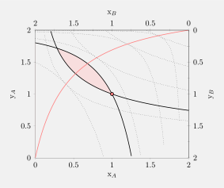

# Economics 4

## General Equilibrium

### Pure Exchange Economies {-}

#### Initial Assumptions {-}

* There are $m$ consumers such that $\mathscr{I} = \{1, \dots, m\}$.
* There are $n$ goods such that $\L = \{1, \dots, n\}$.
* A utility function $u_i : \R^\L \to \R$ represents the preferences of the $i$th consumer.
* Each consumer can consume goods in $x_i \in \R^\L_+$.
* Each consumer has an initial endowment of $w_i \in \R^\L_+$.
* The ordered pair $(u_i, w_i)$ describes each consumer.
* The utility functions represent neoclassical preferences.

::: {.proposition}
If $x \succ_i \mathrm{y}$, then $u_i(x) > u_i(\mathrm{y})$.
:::

::: {.definition name="Exchange Economy"}
A *pure exchange economy* is
$$
\mathscr{E} = \left\langle \mathscr{I}, (u_i, w_i)_{i\in\mathscr{I}} \right\rangle,
$$
where $\mathscr{I}$ is the set of agents; $u_i$ and $w_i$ are the utility function and initial endowment of the $i$th consumer, respectively.
:::

::: {.definition name="Total Endowment"}
$$
\Omega = \sum_{i \in \mathscr{I}} w_i.
$$
:::

::: {.definition name="Resource Allocation"}
The *resource allocation* is denoted by $X = (x_1, x_2, \dots, x_m)$, where $x_i \in \R^\L_+$.
:::

::: {.definition name="Feasible Allocation"}
The *feasible allocation* $\F$ of an economy $\mathscr{E}$ is defined by
$$
\F = \left\{ X = (x_1, x_2, \dots, x_m)\ :\ x_i \in \R^\L_i,\ \sum_{i \in \mathscr{I}} x_i = \sum_{i \in \mathscr{I}} w_i \right\}.
$$
:::

::: {.definition name="Pareto Efficiency"}
Let $\mathscr{E}$ be an exchange economy. A feasible allocation of resources $X$ is said to be *Pareto efficient* if and only if there is no other feasible allocation $\hat{X}$ such that, for every agent in $\mathscr{I}$, $u_i(\hat{x}_i) \geq u_i(x_i)$ and, for at least one agent $j$, $u_j(\hat{x}_j) > u_j(x_j)$.
:::

::: {.definition name="Pareto Dominance"}
Let $X$ and $\hat{X}$ be two feasible allocations. We say that $\hat{X}$ *Pareto dominates* $X$ if and only if
$$
u_i(\hat{x}_{i,1}, \dots, \hat{x}_{i,n}) \geq u_i(x_{i,1}, \dots, x_{i,n}), \quad \forall i \in \mathscr{I},
$$
and there is at least one consumer $j$ such that
$$
u_j(\hat{x}_{j,1}, \dots, \hat{x}_{j,n}) > u_i(x_{j,1}, \dots, x_{j,n}).
$$
:::

::: {.definition name="Contract Curve"}
The set of all Pareto allocations is known as the *contract curve*.
:::

```{r echo=FALSE, fig.cap="Edgeworth Box", out.width="100%", message=FALSE, fig.pos='H'}
library(tidyverse)

```

#### General Case {-}

$$
\begin{align*}
\max_{ x_1,\ \dots\ ,\ x_m } \quad & u_1(x_{1,1}, \dots, x_{1,n}) \\
\text{subject to} \quad & u_2(x_{2,1}, \dots, x_{2,n}) \geq \bar{u}_2, \\
& \quad \vdots \\
& u_m(x_{m,1}, \dots, x_{m,n}) \geq \bar{u}_m; \\
& \sum_{i \in \mathscr{I}} x_{i,1} \leq \sum_{i \in \mathscr{I}} w_{i,1}, \\
& \quad \vdots \\
& \sum_{i \in \mathscr{I}} x_{i,n} \leq \sum_{i \in \mathscr{I}} w_{i,n}.
\end{align*}
$$

::: {.theorem}
Let all utility functions be strictly increasing and quasiconcave, and $\hat{X}$ be a feasible interior allocation. Then $\hat{X}$ is *Pareto efficient* if and only if $\hat{X}$ exhausts all resources and, for all pairs of goods $(\ell, \ell')$,
$$
\MRS(\ell, \ell')(\hat{x}_{1,1}, \dots, \hat{x}_{1,n}) = \cdots = \MRS(\ell, \ell')(\hat{x}_{m,1}, \dots, \hat{x}_{m,n}).
$$
:::

### Competitive Equilibrium {-}

#### Initial Assumptions {-}

* There is a market for each good.
* Every agent can access the market without any cost.
* There is a single price for each good.
* All consumers know the price.
* Each consumer can sell their initial endowment in the market and use the income to buy goods and services.
* Consumers seek to maximize their utility given their budget restriction, independently of what everyone else is doing.
* There is no centralized mechanism.
* People may not know others’ preferences or endowments.
* There is perfect competition (namely, everyone is a price-taker).
* Prices are the only source of information for agents.

::: {.definition name="Competitive Equilibrium"}
An ordered pair of an allocation and a price vector, $\left( X^*, p = (p_1, \dots, p_n) \right)$, is called a *competitive equilibrium* if the following conditions hold:

1. $\forall i \in \mathscr{I}$, $x_i^* = (x_{i,1}^*, \dots, x_{i,n}^*)$ solves the following maximization problem:
$$
\begin{align*}
\max_{ x_i } \quad & u_i(x_i) \\
\text{subject to} \quad & wh + \langle p, x_i \rangle \leq \langle p, w_i \rangle = \sum_{\ell \in \L} p_{\ell} w_{i,\ell}.
\end{align*}
$$
2. Markets clear, i.e. $\displaystyle \sum_{i \in \mathscr{I}} x_{i,\ell}^* = \sum_{i \in \mathscr{I}} w_{i,\ell}$, $\forall \ell \in \L$.
:::

::: {.proposition}
Given at least one consumer with strictly monotonic preferences. Then, if $(X^*, p)$ is a competitive equilibrium, $p_1, p_2, \dots, p_n >0$.
:::

::: {.proposition}
Given at least one consumer with weakly monotonic preferences. Then, if $(X^*, p)$ is a competitive equilibrium, for at least one $\ell$, $p_\ell > 0$.
:::

::: {.proposition}
Let $(X^*, p)$ be a competitive equilibrium. Then $(X^*, cp)$ is also a competitive equilibrium, $\forall c \in \R_+$.
:::

::: {.theorem name="Walras's Law"}
If the consumer $i$ has weakly monotonic preferences and $\hat{x}_i \in x_i^*(p)$, then
$$
\langle p, \hat{x}_i \rangle = \sum_{\ell \in \L} p_{\ell} \hat{x}_{i,\ell} = \sum_{\ell \in \L} p_{\ell} w_{i,\ell} = \langle p, w_i \rangle.
$$
:::

::: {.corollary name="Walras's Law"}
Given weakly monotonic utility functions and $p = (p_1, \dots, p_n)$ such that $p_\ell > 0$. If any $(X^*, p)$ in which maximization condition holds, $\forall i \in \mathscr{I}$, and markets clear $\forall \ell = 1, 2, \dots, n - 1$, then the market clearing condition holds for commodity $n$ as well.
:::

::: {.theorem name="Fixed Point"}
For any continuous function $f : \triangle^{n - 1} \to \triangle^{n - 1}$, there exists a point $p^* = (p_1^*, p_2^*, \dots, p_n^*)$ such that $f(p^*) = p^*$, where:
$$
\triangle^{n - 1} = \left\{ (p_1, p_2, \dots, p_n) \in \R^\L_+ : \sum_{\ell \in \L} p_\ell = 1 \right\}.
$$
:::

::: {.definition name="Shortage"}
We define *shortage* or *excess demand* as follows:
$$
Z(p) = (z_1(p), z_2(p), \dots, z_n(p)) = \sum_{i \in \mathscr{I}} x^*_i (p) - \sum_{i \in \mathscr{I}} w_i.
$$
:::

::: {.proposition}
$p$ is a competitive equilibrium if and only if $Z(p) = 0$.
:::

#### Excess Demand Properties {-}

* Continuous in $p$.
* Zero degree homogeneity.
* $\langle p, Z(p) \rangle = 0$.

::: {.proposition}
The equilibrium is not unique.
:::

::: {.theorem name="Welfare I"}
Given any pure exchange economy such that all consumers have weakly monotonic utility functions. If $(X^*, p)$ is a competitive equilibrium, then $X^*$ is a Pareto efficient allocation.
:::

::: {.theorem name="Welfare II"}
Given an economy $\displaystyle \mathscr{E} = \langle \mathscr{I}, (u_i, w_i)_{i \in \mathscr{I}} \rangle$ where all consumers have weakly monotonic quasiconcave utility functions. If $(x_1, x_2, \dots, x_m)$ is a Pareto optimal allocation, then there exists a redistribution of resources $(\hat{w}_1, \hat{w}_2, \dots, \hat{w}_m)$ and some prices $p = (p_1, p_2, \dots, p_n)$ such that:

1. $\displaystyle \sum_{i \in \mathscr{I}} \hat{w}_i = \sum_{i \in \mathscr{I}} w_i$.
2. $(p, (x_1, x_2, \dots, x_m))$ is a competitive equilibrium of the economy $\mathscr{E}$.
:::

### Production {-}

#### Initial Assumptions {-}

* There are $k$ firms such that $\mathscr{J} = \{1, \dots, k\}$.
* The production of the firm $j$ for good $l$ is described by the function $f_{j,l}$ such that $f_j(z_{\ell,l}) = f_j(z_{1,l}, \dots, z_{n,l})$. Namely, the firm $j$ uses $z_\ell$ units of commodities $\ell \in \L$ to produce commodity $l$.
* The firms are owned by consumers in society.
* The firms' ownership is exogenous.
* $\theta_{i,j}$ represents the fraction of the $j$th firm owned by the $i$th consumer.
* The firms do not have endowments.

::: {.remark}
$$
\sum_{i \in \mathscr{I}} \theta_{i,j} = \theta_{1,j} + \theta_{2,j} + \cdots + \theta_{m,j} = 1 .
$$
:::

::: {.definition name="Competitive Equilibrium"}
$((X^*, Z^*), p)$ is called a *competitive equilibrium* if the following conditions hold:

1. $\forall j \in \mathscr{J}$, $z^*_j = ((z_{j,1,1'}, \dots, z_{j,1,n'}), \dots, (z_{j,n,1'}, \dots, z_{j,n,n'}))$ solves the following maximization problem:
$$
\pi^*_j := \max_{ z_j }\ p_l f_{j,l} (z_\ell) - \sum_{\ell \in \L} p_\ell z_{j, \ell}.
$$
2. $\forall i \in \mathscr{I}$, $x_i^* = (x_{i,1}^*, \dots, x_{i,n}^*)$ solves the following maximization problem:
$$
\begin{align*}
\max_{ x_i } \quad & u_i(x_i) \\
\text{subject to} \quad & \langle p, x_i \rangle \leq \langle p, w_i \rangle + \sum_{j \in \mathscr{J}} \theta_{i,j} \pi^*_j.
\end{align*}
$$
3. Markets clear, i.e. $\displaystyle \sum_{i \in \mathscr{I}} x_{i,\ell}^* + \sum_{j \in \mathscr{J}} \sum_{\ell \in \L} z^*_{j,l} = \sum_{i \in \mathscr{I}} w_{i,\ell} + \sum_{j \in \mathscr{J}} f_{j,l} (z^*_\ell)$, $\forall \ell \in \L$.
:::

::: {.proposition}
Walras's law and welfare theorems hold.
:::

::: {.proposition}
Let $((X^*, Z^*), p)$ be a competitive equilibrium. Then $((X^*, Z^*), cp)$ is also a competitive equilibrium, $\forall c \in \R_+$.
:::

> With production, Edgeworth box diagrams are no longer helpful.

#### General Case {-}

$$
\begin{align*}
\max_{ x_i, z_j } \quad & u_1(x_1) \\
\text{subject to} \quad & u_2(x_2) \geq \bar{u}_2, \\
& \quad \vdots \\
& u_m(x_m) \geq \bar{u}_m; \\
& \sum_{i \in \mathscr{I}} x_{i,1} + \sum_{j \in \mathscr{J}} z_{j,1} \leq \sum_{j \in \mathscr{J}} f_{j,1} (z_\ell) + \sum_{i \in \mathscr{I}} w_{i,1}, \\
& \quad \vdots \\
& \sum_{i \in \mathscr{I}} x_{i,n} + \sum_{j \in \mathscr{J}} z_{j,n} \leq \sum_{j \in \mathscr{J}} f_{j,n} (z_\ell) + \sum_{i \in \mathscr{I}} w_{i,n}.
\end{align*}
$$

::: {.theorem}
Let all utility functions be quasiconcave and strictly increasing, and $(X,Z)$ be a feasible interior allocation. Then $(X, Z)$ is Pareto efficient if and only if all of the following equalities hold for all pairs of goods $(\ell, \ell')$:

1. Marginal rates of substitution are equal across consumers,
$$
\ie \quad \MRS(\ell,\ell')(x_1) = \cdots = \MRS(\ell,\ell')(x_m).
$$
2. Marginal rates of technical substitution are equal across firms for any pair of commodities,
$$
\ie \quad \MRTS(\ell,\ell')(z_1) = \cdots = \MRTS(\ell,\ell')(z_k).
$$
3. Marginal rates of transformation are equal to the marginal rates of substitution,
$$
\ie \quad \MRT(j,j')(z_{\ell''}) = \MRS(\ell,\ell')(x_i), \quad \forall i \in \mathscr{I}.
$$
:::

::: {.definition}
We define the *production possibility set* as the set of all non-negative outputs of goods that the firms can produce using the economy's available factor inputs. The output combinations on the frontier of this set correspond to the Pareto efficient allocation of factor inputs, i.e. the allocation in which it is not possible, given the total factor endowment, to increase the production of one good without decreasing the production of some other good.
:::

::: {.remark name="Friendly reminder on marginal rates"}
<br/>
**Marginal Rate of Substitution** ($\MRS$)

* It is the rate at which a consumer is willing to trade one good for another to maintain a constant level of utility.
* It is the slope of an *indifference curve*.
* It focuses on demand side of consumer theory.

**Marginal Rate of Transformation** ($\MRT$)

* It is the amount of one good that must be given up to produce an additional unit of another good.
* It is the slope of *production possibility frontier*.
* It focuses on supply side of a commodity.

**Marginal Rate of Technical Substitution** ($\MRTS$)

* It is the amount by which the quantity of one input has to be reduced in order to use another input.
* It is the slope of an *isoquant curve*.
* It focuses on production side of economic theory.
:::

## Monopoly and Monopsony

## Game Theory
